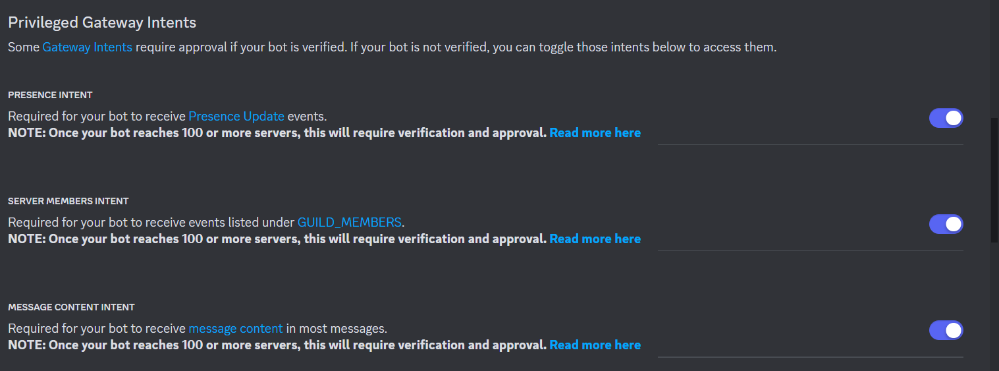

# discord-auto-status-role
discord bot that give automaticly role to users that have a specific status 

## You have to change the bot token, the role id and the server id in the code

# Enable this in discord devloper portal (intents if the image dont load)

